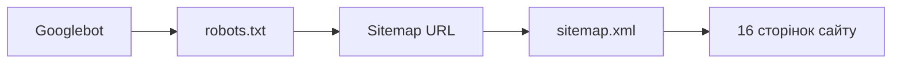

# Розділ 6. XML Sitemap та Google Search Console

## 6.1. Стан до оптимізації

| Параметр | До |
|----------|-----|
| `sitemap.xml` | Був створений раніше, **без** `<lastmod>` |
| Кількість URL у Sitemap | 16 |
| Подання в GSC | Потребує підтвердження студентом |
| Посилання в robots.txt | Додано в кроці 5 |

---

## 6.2. XML Sitemap — загальні дані

| Параметр | Значення |
|----------|----------|
| **URL файлу** | https://mesiriak.github.io/seo-example/sitemap.xml |
| **Формат** | Sitemap 0.9 (`urlset`) |
| **Кількість URL** | **16** |
| **Дата оновлення** | 21.05.2026 |
| **Генерація** | Вручну + узгоджено зі структурою сайту (альтернатива: xml-sitemaps.com, Screaming Frog) |

**Не включено до Sitemap (навмисно):**

| URL / шлях | Причина |
|------------|---------|
| `/docs/*` | Службові звіти; `Disallow` у robots.txt |
| `google0ff43d3df19ad4f1.html` | Файл верифікації GSC, не контент |
| `/drafts/`, `/private/` | Зарезервовані заборонені шляхи |

---

## 6.3. Таблиця URL у Sitemap

| № | URL | priority | changefreq | lastmod | Тип сторінки |
|---|-----|----------|------------|---------|--------------|
| 1 | / | 1.0 | weekly | 2026-05-21 | Головна |
| 2 | /services.html | 0.9 | monthly | 2026-05-21 | Hub послуг |
| 3 | /blog.html | 0.9 | weekly | 2026-05-21 | Hub блогу |
| 4 | /blog-seo-audit.html | 0.8 | monthly | 2026-05-21 | Стаття (Article) |
| 5 | /blog-redirects.html | 0.8 | monthly | 2026-05-21 | Стаття (Article) |
| 6 | /service-technical-audit.html | 0.8 | monthly | 2026-05-21 | Послуга |
| 7 | /service-onpage.html | 0.8 | monthly | 2026-05-21 | Послуга |
| 8 | /service-linkbuilding.html | 0.8 | monthly | 2026-05-21 | Послуга |
| 9 | /faq.html | 0.7 | monthly | 2026-05-21 | FAQ (FAQPage schema) |
| 10 | /about.html | 0.6 | yearly | 2026-05-20 | Про проєкт |
| 11 | /contacts.html | 0.6 | yearly | 2026-05-20 | Контакти |
| 12 | /privacy.html | 0.4 | yearly | 2026-05-20 | Політика |
| 13 | /level1.html | 0.5 | monthly | 2026-05-21 | Crawl depth demo |
| 14 | /folder/level2.html | 0.4 | monthly | 2026-05-21 | Рівень 2 |
| 15 | /folder/subfolder/level3.html | 0.4 | monthly | 2026-05-21 | Рівень 3 |
| 16 | /folder/subfolder/deep/level4.html | 0.3 | monthly | 2026-05-21 | Рівень 4 |

*У файлі `sitemap.xml` — **16** записів `<url>` (одна головна без дубля `index.html`).*

---

## 6.4. Фрагмент XML (приклад для звіту)

```xml
<?xml version="1.0" encoding="UTF-8"?>
<urlset xmlns="http://www.sitemaps.org/schemas/sitemap/0.9">
  <url>
    <loc>https://mesiriak.github.io/seo-example/</loc>
    <lastmod>2026-05-21</lastmod>
    <changefreq>weekly</changefreq>
    <priority>1.0</priority>
  </url>
  <!-- … ще 15 URL (усього 16) … -->
</urlset>
```

Повний файл: `sitemap.xml` у корені репозиторію.

---

## 6.5. Перевірка Sitemap перед поданням

| Перевірка | Результат |
|-----------|-----------|
| Файл відкривається в браузері | ☐ https://mesiriak.github.io/seo-example/sitemap.xml |
| Усі URL з `https://` (абсолютні) | ✅ |
| Важливі сторінки включені | ✅ 16 URL |
| `lastmod` у форматі ISO (YYYY-MM-DD) | ✅ |
| Посилання в robots.txt | ✅ `Sitemap: …/sitemap.xml` |

📸 **Скріншот 6.1** — браузер: відкритий sitemap.xml (XML у вигляді дерева / тексту)

---

## 6.6. Надсилання Sitemap до Google Search Console

### Покрокова інструкція

1. Відкрити [Google Search Console](https://search.google.com/search-console).
2. Обрати ресурс: **https://mesiriak.github.io/seo-example/** (або URL-prefix).
3. Меню зліва → **Sitemaps** (Карти сайту).
4. У полі **Add a new sitemap** ввести: `sitemap.xml`
5. Натиснути **Submit** (Надіслати).
6. Дочекатися статусу: **Success** (успішно).

| Поле в GSC | Значення |
|------------|----------|
| Submitted sitemap | `sitemap.xml` |
| Full URL | `https://mesiriak.github.io/seo-example/sitemap.xml` |

### Очікувані показники в GSC (після обробки)

| Показник | Очікування |
|----------|------------|
| Status | Success |
| Discovered pages | **16** |
| Indexed | Зростає протягом днів/тижнів |

📸 **Скріншот 6.2** — GSC → Sitemaps → Status: **Success**, Discovered URLs  
📸 **Скріншот 6.3** — (опційно) Indexing → Pages — динаміка після подання

**Примітка для звіту:** якщо статус тимчасово **Couldn't fetch**, перевірити деплой на GitHub Pages і доступність URL sitemap у браузері, повторити Submit через 24 год.

---

## 6.7. Зв’язок robots.txt ↔ Sitemap



| Файл | Роль |
|------|------|
| robots.txt | Дозволяє crawl + вказує шлях до Sitemap |
| sitemap.xml | Перелік пріоритетних URL для індексації |

---

## 6.8. Порівняння до / після

| Критерій | До | Після |
|----------|-----|-------|
| lastmod у Sitemap | Ні | Так (усі URL) |
| Актуальність після лаб. 03 | Часткова | Оновлено 21.05.2026 |
| robots.txt → Sitemap | Додано в розд. 5 | ✅ |
| Подання в GSC | — | Submit `sitemap.xml` |
| Скрін підтвердження GSC | — | Скрін 6.2 |

---

## 6.9. Висновок розділу 6

Оновлено **XML Sitemap** з 16 URL, датами `lastmod`, пріоритетами та `changefreq`. Файл доступний за публічним URL і задекларований у **robots.txt**. Після надсилання **`sitemap.xml`** у Google Search Console пошуковий робот отримує структурований перелік сторінок навчального сайту, що покращує **crawlability** та прискорює виявлення контенту після технічної оптимізації (WebP, lazy load).
