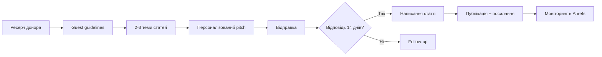

# Розділи 3–5. Донори, outreach-стратегія, guest post pitch

**Сайт:** https://mesiriak.github.io/seo-example/  
**Ніша:** SEO, on-page оптимізація, навчальні матеріали  
**Дата:** 21.05.2026

---

# Розділ 3. Перелік потенційних донорів (10–15 джерел)

## 3.1. Критерії відбору

| Критерій | Вимога |
|----------|--------|
| DR донора | ≥ 20–25 (для нішевих UA-блогів допустимо 15+ за активним контентом) |
| Тематика | SEO, digital marketing, веброзробка, навчання |
| Трафік / активність | Оновлення контенту ≤ 6 міс., коментарі / соцмережі |
| Тип | Guest post, resource page, broken link, огляд / listicle |
| Уникати | PBN, спам-каталоги, нерелевантні gambling/adult |

## 3.2. Повна таблиця донорів

| № | URL сайту | DR (оцінка) | Тематика | Тип посилання | Пріоритет | Обґрунтування |
|---|-----------|-------------|----------|---------------|-----------|---------------|
| 1 | https://referr.com.ua/ | 27 | SEO, біржі посилань, UA | Guest post / згадка в огляді | **Високий** | Link gap: вже лінкує на collaborator; релевантний огляд сервісів |
| 2 | https://hostiq.ua/blog/ | 64 | Хостинг, IT, заробіток онлайн | Guest post, contextual | **Високий** | Link gap, DR 64, UA, блог з живим контентом |
| 3 | https://netpeak.net/ua/blog/ | 72 | SEO, digital marketing, UA | Guest post | **Високий** | Сильний UA SEO-бренд, освітній блог |
| 4 | https://webpromo.ua/blog/ | 65 | SEO-агентство, UA | Guest post | **Високий** | Пряма ніша, українська аудиторія |
| 5 | https://seologic.com.ua/blog/ | 45 | SEO-послуги, UA | Guest post | **Високий** | Тематичний конкурент/партнер по ніші |
| 6 | https://morningscore.io/blog/ | 71 | SEO tools, огляди | Listicle / guest post | Середній | Link gap з ahrefs; англ., складніше пробитись |
| 7 | https://marketermilk.com/blog/ | 67 | Маркетинг, SEO tools | Listicle | Середній | «Best SEO tools» — згадка навчального ресурсу |
| 8 | https://www.searchengines.guru/ | 70 | SEO-форум, UA/RU | Resource / expert post | Середній | Спільнота SEO-фахівців, висока релевантність |
| 9 | https://dou.ua/ | 75 | IT, освіта, UA | Стаття / best practices | Середній | IT-аудиторія, можливий матеріал про SEO-навчання |
| 10 | https://blog.hubspot.com/ | 93 | Marketing, SEO | Guest post | Низький | Високий DR, дуже конкурентний outreach |
| 11 | https://backlinko.com/ | 91 | SEO, навчання | Guest post | Низький | Еталон, низький response rate |
| 12 | https://serpstat.com/blog/uk/ | 68 | SEO tools, UA | Guest post | **Високий** | UA/RU блог SEO-інструменту, близька тема |
| 13 | https://sitechecker.pro/blog/uk/ | 55 | SEO audit, tools | Guest post / resource | Середній | Тема технічного та on-page SEO |
| 14 | https://unisender.com/ua/blog/ | 58 | Email + marketing, UA | Guest post | Середній | Перетин digital marketing + освіта |
| 15 | https://itcluster.lviv.ua/ | 40 | IT-освіта, UA | Resource page / новина | Середній | Навчальні IT-проєкти, локальний контекст |

## 3.3. Розподіл за типом стратегії

| Стратегія | Кількість | № з таблиці |
|-----------|-----------|-------------|
| **Guest posting** | 11 | 1–5, 6–8, 10–15 |
| **Resource page / listicle** | 3 | 6, 7, 9 |
| **Broken link building** | 1* | 13 (аудит зламаних links у статтях про SEO tools) |
| **Digital PR** | 1* | 9 (новина про навчальний open-source SEO demo) |

\* Потребує окремого ресерчу зламаних URL у ніші.

## 3.4. Висновок розділу 3

Сформовано **15 потенційних донорів** з пріоритетом на **українські SEO-блоги** (referr, netpeak, webpromo, serpstat) та **link gap-домени** з Розділу 2. Реалістичний фокус на **високому** пріоритеті (№ 1–5, 12): DR 27–72, пряма тематика, guest post guidelines на більшості агентських блогів.

---

# Розділ 4. Стратегія outreach

## 4.1. Загальний підхід

Для **SEO Demo Site** (0 referring domains) обрано **комбіновану стратегію**:

1. **Guest posting** (70% зусиль) — основний канал перших RD.
2. **Resource page / listicle** (20%) — потрапляння в підбірки «SEO ресурси / tools».
3. **Broken link building** (10%) — точкова заміна 404 у статтях про SEO.

**Не використовуємо:** масові каталоги, link exchange, PBN.

## 4.2. Пріоритизація донорів

| Пріоритет | Донори | Критерії |
|-----------|--------|----------|
| **Високий** | referr.com.ua, hostiq.ua, netpeak.net, webpromo.ua, seologic.com.ua, serpstat.com | UA, SEO-ніша, link gap або прямий match, реалістичний DR |
| **Середній** | morningscore.io, marketermilk.com, searchengines.guru, dou.ua, sitechecker.pro, unisender.com, itcluster.lviv.ua | Релевантність є, вищий поріг входу або EN |
| **Низький** | hubspot.com, backlinko.com | Максимальний DR, низький response rate — лише після успіхів на UA-рівні |

## 4.3. Покроковий план (guest posting)



| Крок | Дія | Термін |
|------|-----|--------|
| 1 | Аналіз 3 останніх статей донора, tone of voice | 1–2 год / донор |
| 2 | Перевірка «Write for us» / guest post policy | 30 хв |
| 3 | 2–3 теми з унікальним кутом (навчальний кейс SEO Demo) | 1 год |
| 4 | Персоналізований email (шаблон А або Б) | 30 хв |
| 5 | Follow-up якщо немає відповіді | +7 днів |
| 6 | Написання статті 1500–2000 слів | 1–2 тижні |
| 7 | Публікація, перевірка dofollow посилання | — |

## 4.4. План на 30 / 60 / 90 днів

| Період | Дії | Цільові KPI |
|--------|-----|-------------|
| **30 днів** | Outreach на 10 донорів (високий пріоритет); 2 follow-up раунди; 1 стаття в роботу | 3–5 відповідей (30–50% response); 1 домовленість |
| **60 днів** | 5 guest posts опубліковано / в процесі; broken link — 15 сайтів перевірено; 2 listicle pitch | +3–5 нових RD; 5–10 backlinks |
| **90 днів** | Масштабування на середній пріоритет; кейс «як ми зробили SEO demo» для PR | **8–10 referring domains**; DR проєкту +3–5* |

\* DR піддомену GitHub може змінюватись повільно; орієнтир — **Referring domains** в AWT.

## 4.5. KPI стратегії

| Метрика | База (зараз) | Ціль 90 днів |
|---------|--------------|--------------|
| Referring domains | 0 | **8–10** |
| Backlinks (dofollow) | 0 | **12–15** |
| Response rate outreach | — | **10–15%** |
| Опублікованих guest posts | 0 | **4–6** |
| UR (Ahrefs) | 0 | **5–15** |

## 4.6. Висновок розділу 4

Стратегія зфокусована на **якісному guest posting** для UA SEO-ніші з використанням **link gap** з Розділу 2. Реалістичний горизонт перших результатів — **30–60 днів**, перші RD — **60–90 днів**.

---

# Розділ 5. Шаблони guest post pitch

## 5.1. Шаблон А — тематичний блог / освітній ресурс (UA)

**Коли використовувати:** netpeak, webpromo, seologic, serpstat, referr — редактор = автор контенту, менш формальний тон.

```
Тема: Стаття для [Назва блогу]: [конкретна тема]

Вітаю, [Ім'я]!

Нещодавно читав вашу статтю «[Назва статті]» на [домен] —
особливо зайшов розділ про [конкретна деталь].

Я [Ім'я Прізвище], студент/спеціаліст з SEO. Разом із командою
зробили відкритий навчальний проєкт SEO Demo Site — демо-сайт
для лабораторних з on-page SEO, Core Web Vitals та structured data:
https://mesiriak.github.io/seo-example/

Пропоную гостьову статтю для вашої аудиторії — на вибір:

1. «Як провести SEO аудит навчального сайту: чекліст для початківців»
2. «On-page SEO на практиці: title, meta description та JSON-LD»
3. «Core Web Vitals для студентів: що вимірювати в PageSpeed Insights»

Стаття [1 або 2] буде корисна читачам [Назва блогу], бо [1 речення:
чому саме їхній аудиторії — початківці, практики, UA ринок].

Можу надати унікальний матеріал (~1800 слів), скріни та приклади коду.
Посилання на демо-проєкт — лише як на навчальний кейс.

Чи цікаво обговорити публікацію?

З повагою,
[Ім'я]
[Email] | [Telegram за бажанням]
```

---

## 5.2. Шаблон Б — медіа / спеціалізоване видання (формальніший)

**Коли використовувати:** hostiq.ua, dou.ua, великі портали, англомовні огляди (marketermilk, morningscore).

```
Тема: Пропозиція матеріалу для [Назва видання]: [Тема]

Вітаю, редакціє [Назва видання],

Звертаюся з пропозицією експертної статті для вашого видання.

Тема: «[Конкретна тема, напр. Технічна оптимізація навчальних
веб-проєктів: метадані, CWV та sitemap]».

Матеріал міститиме практичний кейс на базі відкритого репозиторію
SEO Demo Site (GitHub Pages): аудит до/після оптимізації з
підтвердженими метриками PageSpeed Insights та Ahrefs Webmaster Tools.

Обсяг: ~2000 слів. Структура: проблема → методика → результати →
чекліст для читачів. Унікальні скріни та таблиці.

Про автора: [Ім'я], [курс/спеціалізація SEO/digital marketing],
досвід публікацій: [посилання, якщо є, або «навчальні проєкти»].

Якщо тема відповідає редакційному плану, готовий надіслати план статті
протягом 3 робочих днів.

З повагою,
[Ім'я Прізвище]
SEO Demo Site / [Університет]
[email]
```

---

## 5.3. Персоналізовані версії (3 приклади)

### Персоналізація 1 — referr.com.ua (шаблон А)

**Тема:** Гостьова стаття про on-page SEO для referr.com.ua

**Персоналізація:** посилання на їхній огляд бірж посилань (link gap); тема — on-page як доповнення до link building.

**Теми статей:**
1. On-page SEO перед закупівлею посилань: що перевірити на сайті
2. Чекліст метаданих для нових landing pages

---

### Персоналізація 2 — hostiq.ua (шаблон Б)

**Тема:** Кейс-стаття: технічна оптимізація GitHub Pages для SEO-навчання

**Персоналізація:** згадка їхньої статті про заробіток онлайн / IT; кут — навчальний проєкт на GitHub Pages як приклад «безкоштовного хостингу + SEO».

**Акцент:** Core Web Vitals, WebP, lazy loading — практичні навички для їхньої IT-аудиторії.

---

### Персоналізація 3 — serpstat.com/blog/uk (шаблон А)

**Тема:** Практичний гід JSON-LD для студентів SEO

**Персоналізація:** продукт Serpstat = SEO tools; стаття про Schema.org (FAQPage, Article) на прикладі демо-сайту — ідеально в екосистему блогу.

**Теми:**
1. FAQPage та Article у JSON-LD: валідація в Rich Results Test
2. robots.txt і sitemap.xml для невеликих сайтів

---

## 5.4. Підхід до персоналізації (для звіту)

| Елемент | Чому важливо |
|---------|-------------|
| Конкретна стаття донора | Доводить, що лист не спам |
| Теми під аудиторію донора | Цінність для них, не лише для посилання |
| Навчальний кейс SEO Demo | Унікальний кут, не generic «SEO tips» |
| Обсяг і формат | Знижує бар'єр для редактора |
| М'який CTA | «Чи цікаво обговорити?» — не вимога |

## 5.5. Висновок розділу 5

Підготовлено **2 базові шаблони** (блог А, медіа Б) та **3 персоналізовані pitch** для referr.com.ua, hostiq.ua та serpstat.com/blog/uk. Усі листи містять конкретні теми, посилання на реальний проєкт і обґрунтування для аудиторії донора.
